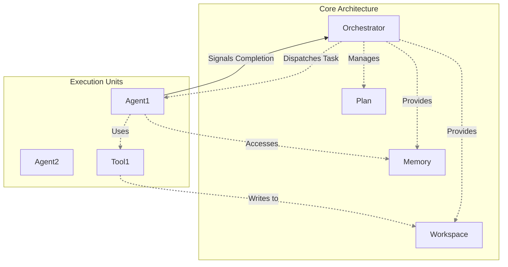
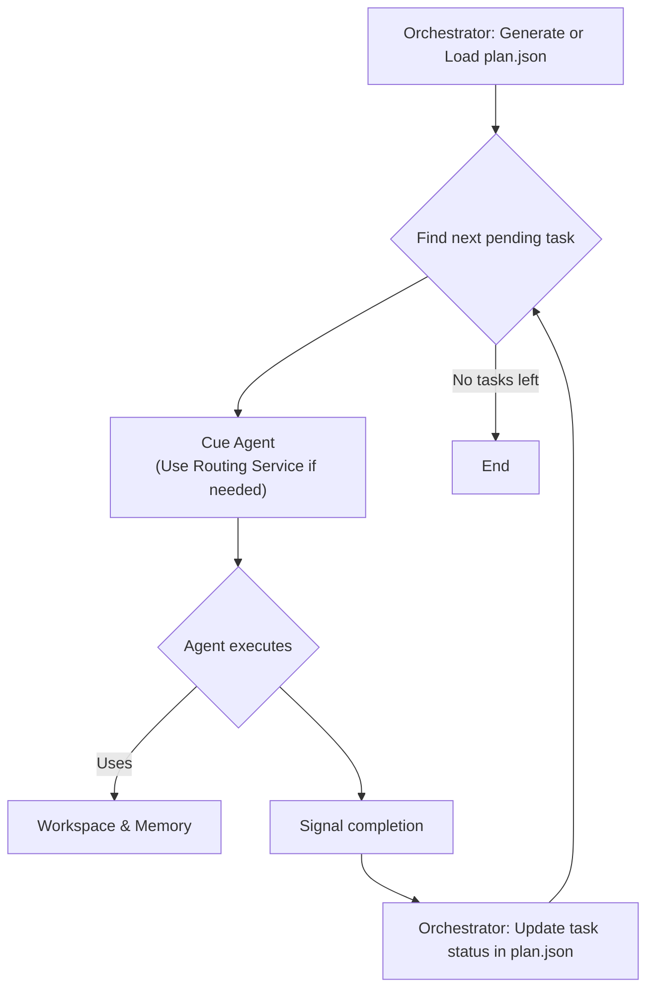

# Orchestration System

## 1. Core Principles

The AgentX orchestration model is designed to coordinate multiple autonomous agents to achieve complex goals reliably and predictably. The architecture is built on three core principles:

1.  **Separation of Concerns**: The architecture strictly separates the high-level coordination logic from the specific task execution. The `Orchestrator` handles coordination, while individual `Agents` handle execution. This prevents creative agents from derailing the high-level plan.
2.  **Plan-Driven Execution**: Every task is driven by a structured, machine-readable `Plan`. The `Plan` is the single source of truth for the Orchestrator, defining the sequence of tasks, their dependencies, and their goals. This ensures the process is predictable, repeatable, and resumable.
3.  **Autonomous Agents**: Agents are independent, expert problem-solvers. They are given a specific task from the Plan and the autonomy to use their configured tools to achieve it. The framework provides them with resources (`Workspace`, `Memory`) but does not dictate the specifics of their internal process.

## 2. Core Architecture Components

The architecture consists of several key components that work together to manage and execute tasks.

### 2.1. The Orchestrator

The Orchestrator is the central process manager of the system. It is a deterministic component whose sole responsibility is to execute the `Plan`. It is not an agent and has no creative or decision-making capabilities beyond what is required to follow the plan. Its functions are divided into its core responsibilities and the auxiliary services it consumes.

#### 2.1.1. Core Responsibilities

These are the deterministic functions the Orchestrator performs in its main execution loop.

1.  **Plan Management**: Loading the `Plan` and tracking the status of each task.
2.  **Task Dispatch**: Cueing the appropriate agent when a task is ready to be executed.
3.  **Task Briefing**: Assembling a focused briefing for an agent's task.
4.  **Resource Provisioning**: Providing agents with access to the `Workspace` and `Memory`.

#### 2.1.2. Auxiliary Services

These are focused, LLM-powered services the Orchestrator uses for specific setup tasks that require language understanding.

1.  **Planning Service**: If no `Plan` exists, this service is called once to translate a high-level user goal into a structured `plan.json` file.
2.  **Routing Service**: If a `Plan` task does not specify an agent, this service is used to select the best agent based on the task and agent descriptions.

### 2.2. The Plan

The **Plan** is a declarative data structure, typically defined in a `plan.json` file, that outlines all the steps required to achieve a high-level goal.

**Key Characteristics:**

- **Declarative**: It describes _what_ needs to be done, not _how_ to do it.
- **Structured**: It uses a formal Pydantic schema (`agentx.core.plan.Plan`) for validation and reliability.
- **Centrally Managed**: The plan is static during an execution run. It is managed by the Orchestrator and is not modified by agents.

### 2.3. The Workspace: Storing Facts

The Workspace is a standard file system that holds the tangible, objective artifacts of the project. It is the repository for the "nouns" of the project—the immutable facts that agents operate on.

- **Purpose**: To store and retrieve raw data, source code, downloaded documents, and final reports.
- **Access**: By a standard file path (e.g., `read_file('data/source.csv')`).

### 2.4. The Shared Memory: Storing Actionable Knowledge

The Shared Memory is a strategic store that guides the ongoing task toward a better result. It holds the "verb" of the project, answering the question, "Given the facts, what should we do next?"

- **Purpose**: To store insights, derived conclusions, and, most importantly, knowledge about _how to proceed_.
- **Access**: By concept or natural language query (e.g., `recall("What is the current strategy for analyzing the data?")`).

An agent saves a raw data file (a fact) to the `Workspace`. After analyzing it, it saves its conclusion about how that fact should influence the next step (actionable knowledge) to the `Memory`.

#### 2.4.1. Memory Update Protocol

The `Memory` is updated from two primary sources: **Agents** (who contribute their findings) and the **Orchestrator** (which commits user directives).

1.  **Agent-Driven Updates**: The primary responsibility for adding task-related knowledge to the `Memory` lies with the **Agents**.

    - **During Task Execution**: When an agent discovers a critical piece of information, it should commit that fact to memory immediately.
    - **Upon Task Completion**: As part of its final output, an agent should synthesize a summary of its work and its conclusions, and add this summary to the Memory.

2.  **User-Driven Updates**: When a user interrupts a task with a new preference or strategic directive (e.g., "Don't use pie charts; use bar charts instead"), it is the **Orchestrator's** responsibility to commit this preference to `Memory` as a high-priority piece of actionable knowledge. This ensures the user's guidance is immediately available to all subsequent agents.

## 3. The Execution Flow

The orchestration unfolds with disciplined precision, guided by the Orchestrator:

1.  **Generate or Load Plan**: If no `plan.json` exists, the Orchestrator's **Planning Service** generates one from the initial user prompt. Otherwise, it loads the existing plan.
2.  **Get Next Task**: It identifies the next `pending` task based on the plan's structure and dependencies.
3.  **Cue Agent**: It cues the designated agent to perform their task. If no agent is designated, it uses its **Routing Service** to select the most suitable one.
4.  **Execute**: The agent performs its work using its tools to interact with the `Workspace` and `Memory`.
5.  **Update Status**: Upon completion, the agent signals back to the Orchestrator.
6.  **Update Plan**: The Orchestrator precisely updates the task's status in `plan.json`, recalculates progress, and saves the file.
7.  **Loop**: The cycle continues with relentless precision until the plan is complete or a terminal failure occurs.

## 4. Error Handling and Recovery

A robust system must anticipate and handle failure gracefully. Since agents are not permitted to modify the `Plan` upon failure, we must encode recovery strategies directly into the plan itself.

This is achieved by adding an `on_failure` policy to each `Task` within the `Plan` schema. This field instructs the Orchestrator on how to proceed when a task is marked as `failed`.

- **`halt` (Default)**: The Orchestrator stops all further execution immediately. The entire task is halted, and the failure is reported to the user.
- **`escalate_to_user`**: The Orchestrator pauses the execution loop and waits for direct input from the user on how to proceed.
- **`proceed`**: The Orchestrator marks the failed task, records the error, and moves on to the next independent task in the plan.

## 5. Human-in-the-Loop: Requiring Approvals

For critical steps in a workflow, autonomous execution is not enough; user oversight is required. The design incorporates a Human-in-the-Loop (HITL) model for explicit approvals.

This is achieved by adding a simple `approval_required` boolean flag to the `Task` schema within the `Plan`. When a task with this flag is completed, the Orchestrator will pause and escalate to the user for a "go" or "no-go" decision before proceeding.

## 6. Core Design Principles

This architecture is built on three key principles to ensure robust, long-running agentic processes:

- **Resumability**: Because the Plan is the persistent source of truth, a task can be stopped and restarted at any time. The Orchestrator simply re-reads the plan and picks up where it left off.
- **Interruptibility**: The system is designed to be paused and adjusted by the user. User instructions during a task can be committed to `Memory` (as preferences) or trigger a full re-planning cycle.
- **Reliability**: The system's reliability stems from the Orchestrator's unwavering discipline. By treating the plan as a fixed set of instructions, it prevents creative agents from derailing the mission. This clear separation of concerns—creative execution by agents, disciplined coordination by the Orchestrator—is the cornerstone of a robust system.
