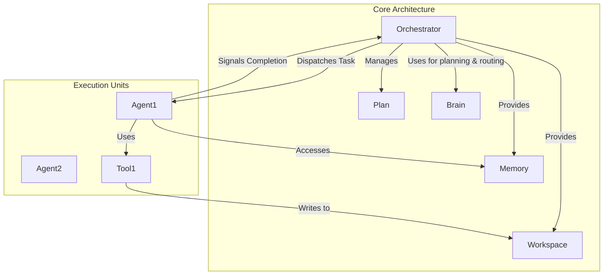

# Orchestration System

## 1. Core Principles

The AgentX orchestration model is designed to coordinate multiple autonomous agents to achieve complex goals reliably and predictably. The architecture is built on three core principles:

1.  **Separation of Concerns**: The architecture strictly separates the high-level coordination logic from the specific task execution. The `Orchestrator` handles coordination, while individual `Agents` handle execution. This prevents creative agents from derailing the high-level plan.
2.  **Plan-Driven Execution**: Every task is driven by a structured, machine-readable `Plan`. The `Plan` is the single source of truth for the Orchestrator, defining the sequence of tasks, their dependencies, and their goals. This ensures the process is predictable, repeatable, and resumable.
3.  **Autonomous Agents**: Agents are independent, expert problem-solvers. They are given a specific task from the Plan and the autonomy to use their configured tools to achieve it. The framework provides them with resources (`Workspace`, `Memory`) but does not dictate the specifics of their internal process.

## 2. Core Architecture Components

The architecture consists of several key components that work together to manage and execute tasks.

### 2.1. The Orchestrator: The System's Process Manager

The Orchestrator is the central process manager of the system. It is a deterministic, non-creative component whose sole responsibility is to execute the `Plan` with unwavering precision. It operates as a state machine, moving the system from one task to the next according to the instructions in the `Plan`. For any task requiring language understanding, such as initial plan generation or agent routing, it delegates the "thinking" to a dedicated `Brain` component.

Its core logic is a persistent loop that methodically executes the plan. This loop is the engine that drives the entire system forward.

1.  **Initialize and Generate Plan (If Needed)**: The loop begins. The Orchestrator's first action is to ensure a plan exists. It looks for the `plan.json` file in the workspace.

    - If `plan.json` is found, it is loaded into memory.
    - If `plan.json` is **not** found, the Orchestrator executes a **one-time, internal subroutine to generate the plan**. This routine uses its `Brain` instance to translate the initial high-level user goal into the structured `plan.json` format. The resulting file is saved, and the loop proceeds.

2.  **Identify Next Actionable Task**: It scans the list of tasks in the plan to find the next task to execute. A task is considered actionable if its status is `pending` and all of its dependencies (as listed in its `dependencies` array) have a status of `completed`.

3.  **Select Agent (and Route If Needed)**: The Orchestrator identifies which agent must execute the task.

    - If the task object in the plan has a specific `agent` assigned, the Orchestrator selects that agent.
    - If the `agent` field is null, the Orchestrator executes an **internal routing subroutine**. This routine uses its `Brain` instance to match the task description against the capabilities of all available agents and selects the most suitable one.

4.  **Prepare Task Briefing**: The Orchestrator assembles a complete and isolated set of instructions for the selected agent. This briefing contains:

    - The specific `task` description and `goal` from the plan.
    - Access handles to the `Workspace` and `Memory`.
    - The specific list of `tools` the agent is permitted to use for this task.

5.  **Dispatch and Monitor**: The Orchestrator sends the briefing to the agent and immediately updates the task's status to `in_progress` in its in-memory representation of the plan. It then waits for the agent to signal that it has finished.

6.  **Process Completion Signal**: When the agent completes its work, it returns a status signal (`success` or `failure`).

    - **On Success**: The Orchestrator updates the task's status to `completed`.
    - **On Failure**: It updates the status to `failed` and immediately consults the task's `on_failure` policy (`halt`, `escalate_to_user`, `proceed`) to determine the next step.

7.  **Persist State**: After processing the completion signal, the Orchestrator writes the entire updated plan, including the new task status, back to the `plan.json` file on disk. **This is the critical step that ensures resumability.** If the system is stopped, it can be restarted, and the Orchestrator will simply load the `plan.json` and know exactly where it left off.

8.  **Continue or Terminate**: The Orchestrator checks if there are any more actionable tasks. If so, the loop repeats from Step 2. If all tasks are `completed` (or the process has been halted), the Orchestrator terminates the execution.

### 2.2. The Plan

The **Plan** is a declarative data structure, typically defined in a `plan.json` file, that outlines all the steps required to achieve a high-level goal.

**Key Characteristics:**

- **Declarative**: It describes _what_ needs to be done, not _how_ to do it.
- **Structured**: It uses a formal Pydantic schema (`agentx.core.plan.Plan`) for validation and reliability.
- **Centrally Managed**: The plan is the single source of truth. The Orchestrator reads from it and writes status updates to it. It is never modified by agents.

### 2.3. The Workspace: Storing Facts

The Workspace is a standard file system that holds the tangible, objective artifacts of the project. It is the repository for the "nouns" of the project—the immutable facts that agents operate on.

- **Purpose**: To store and retrieve raw data, source code, downloaded documents, and final reports.
- **Access**: By a standard file path (e.g., `read_file('data/source.csv')`).

### 2.4. The Memory: Storing Actionable Knowledge

The Memory is a strategic store that guides the ongoing task toward a better result. It holds the "verb" of the project, answering the question, "Given the facts, what should we do next?"

- **Purpose**: To store insights, derived conclusions, and, most importantly, knowledge about _how to proceed_.
- **Access**: By concept or natural language query (e.g., `recall("What is the current strategy for analyzing the data?")`).

An agent saves a raw data file (a fact) to the `Workspace`. After analyzing it, it saves its conclusion about how that fact should influence the next step (actionable knowledge) to the `Memory`.

#### 2.4.1. Memory Update Protocol

The `Memory` is updated from two primary sources: **Agents** (who contribute their findings) and the **Orchestrator** (which commits user directives).

1.  **Agent-Driven Updates**: The primary responsibility for adding task-related knowledge to the `Memory` lies with the **Agents**.

    - **During Task Execution**: When an agent discovers a critical piece of information, it should commit that fact to memory immediately.
    - **Upon Task Completion**: As part of its final output, an agent should synthesize a summary of its work and its conclusions, and add this summary to the Memory.

2.  **User-Driven Updates**: When a user interrupts a task with a new preference or strategic directive (e.g., "Don't use pie charts; use bar charts instead"), it is the **Orchestrator's** responsibility to commit this preference to `Memory` as a high-priority piece of actionable knowledge. This ensures the user's guidance is immediately available to all subsequent agents.

### 2.5. User Interruption and Control

To be effective, the system must support user intervention and control over long-running tasks. Rather than requiring tasks to run from start to finish without interruption, the architecture supports a **stop-and-resume** pattern.

The key principle is **stateful resumability**: when a task is stopped, all progress is persisted to disk. When execution restarts, the system automatically detects the existing state and continues from where it left off.

This enables several important user control patterns:

- **Task Interruption**: Users can stop execution at any time, and the system preserves all progress.
- **State Inspection**: Between runs, users can examine the workspace, plan status, and accumulated memory.
- **Directive Injection**: Users can add new strategic guidance to Memory before resuming.
- **Plan Modification**: Advanced users can manually edit the plan file to adjust the remaining work.

This stateful approach makes the system truly interactive and directable without requiring complex real-time control interfaces.

## 3. Error Handling and Recovery

A robust system must anticipate and handle failure gracefully. Recovery strategies are encoded directly into the plan itself via an `on_failure` policy on each `Task`.

- **`halt` (Default)**: The Orchestrator stops all further execution immediately.
- **`escalate_to_user`**: The Orchestrator pauses the execution and waits for direct user input.
- **`proceed`**: The Orchestrator marks the task as failed, records the error, and moves on to the next independent task.

## 4. Human-in-the-Loop: Requiring Approvals

For critical steps, a task in the `Plan` can be flagged with `approval_required: true`. When a task with this flag is completed, the Orchestrator will pause and escalate to the user for a "go" or "no-go" decision before proceeding.

## 5. Core Design Qualities

This architecture is designed to produce three key qualities:

- **Resumability**: Because the `Plan` is the persistent source of truth, a task can be stopped and restarted. The Orchestrator simply re-reads the plan and picks up where it left off.
- **Interruptibility**: Through the stop-and-resume pattern, users can interrupt execution, inspect state, inject directives into `Memory`, and resume with full context preservation.
- **Reliability**: Reliability stems from the Orchestrator's discipline. By treating the plan as a fixed set of instructions, it prevents creative agents from derailing the mission. This clear separation of concerns—creative execution by agents, disciplined coordination by the Orchestrator—is the cornerstone of the system.
