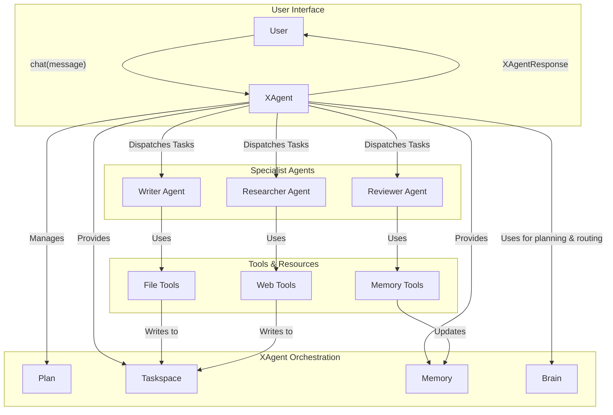

# Orchestration System

## 1. Core Principles

The AgentX orchestration model is designed to coordinate multiple autonomous agents to achieve complex goals reliably and predictably. The architecture is built on three core principles:

1.  **Unified Conversational Interface**: Users interact with a single entity (`XAgent`) that manages the entire multi-agent team behind the scenes. This provides a natural, chat-like experience while maintaining sophisticated orchestration capabilities.
2.  **Plan-Driven Execution**: Every task is driven by a structured, machine-readable `Plan`. The `Plan` is the single source of truth for XAgent, defining the sequence of tasks, their dependencies, and their goals. This ensures the process is predictable, repeatable, and resumable.
3.  **Autonomous Specialist Agents**: Specialist agents are independent, expert problem-solvers. They are given specific tasks from the Plan and the autonomy to use their configured tools to achieve them. The framework provides them with resources (`Taskspace`, `Memory`) but does not dictate the specifics of their internal process.

## 2. Core Architecture Components

The architecture centers around XAgent as the unified interface that coordinates specialist agents to execute complex tasks.



### 2.1. XAgent: The Unified Conversational Interface

XAgent is the single point of contact that users interact with to manage complex multi-agent tasks. It combines the execution context management of the former TaskExecutor with the strategic coordination capabilities of the former Orchestrator into one conversational interface.

**User Context**: XAgent operates within a user-scoped context, ensuring all taskspace operations, memory access, and tool executions are isolated to the authenticated user's data. This provides secure multi-tenant operation while maintaining the seamless conversational experience.

**Key Capabilities:**

- **Rich Message Handling**: Supports text, attachments, images, and other multimedia content
- **LLM-Driven Plan Adjustment**: Intelligently determines which tasks need regeneration while preserving completed work
- **Conversational Task Management**: Users can chat naturally to request changes, ask questions, or provide guidance
- **Automatic Taskspace Management**: Handles file storage, artifact management, and taskspace organization within user-scoped directories

**Core Conversation Loop:**

1. **Message Analysis**: When a user sends a message, XAgent uses its Brain to analyze the intent:

   - Is this a plan adjustment request? ("regenerate the report with more visual appeal")
   - Is this an informational query? ("what sources did you use?")
   - Is this a new task or continuation?

2. **Impact Assessment**: For plan adjustments, XAgent determines:

   - Which completed tasks can be preserved
   - Which tasks need regeneration
   - What new tasks might be needed

3. **Intelligent Execution**: XAgent coordinates specialist agents to fulfill the request while minimizing rework

4. **Response Generation**: Returns an `XAgentResponse` with the results, preserved work details, and execution metadata

### 2.2. The Plan-Driven Orchestration Loop

XAgent maintains the same robust 8-step orchestration loop, now integrated into its conversational interface:

1.  **Initialize and Generate Plan (If Needed)**: When starting a new task or when no plan exists, XAgent generates a structured plan using its Brain.

2.  **Identify Next Actionable Task**: Scans the plan to find tasks that are ready to execute (status is `pending` and all dependencies are `completed`).

3.  **Select Specialist Agent**: Assigns the task to the most appropriate specialist agent based on the task requirements and agent capabilities.

4.  **Prepare Task Briefing**: Creates focused instructions for the specialist agent, including the specific task goal and available tools.

5.  **Dispatch and Monitor**: Sends the task to the specialist agent and updates the plan status to `in_progress`.

6.  **Process Completion Signal**: Updates the plan based on the agent's success or failure response.

7.  **Persist State**: Saves the updated plan to ensure resumability.

8.  **Continue or Respond**: Either continues with the next task or returns the results to the user.

### 2.3. User Interaction Patterns

XAgent supports several natural interaction patterns:

#### **Initial Task Creation**

```python
x = await start_task("Create a market research report on AI trends", "config/team.yaml")
```

#### **Simple Conversation**

```python
response = await x.chat("Update the report with more visual charts")
print(response.text)
```

#### **Rich Messages with Attachments**

```python
from agentx.core.message import Message, TextPart, ArtifactPart

response = await x.chat(Message(parts=[
    TextPart("Use this style guide for the report"),
    ArtifactPart(artifact=style_guide_pdf)
]))
```

#### **Informational Queries**

```python
response = await x.chat("What sources did you use for the market analysis?")
response = await x.chat("Show me the current progress")
```

#### **Plan Adjustments**

```python
# XAgent preserves completed research but regenerates the writing
response = await x.chat("Regenerate the report to focus on enterprise applications")
print(f"Preserved: {response.preserved_steps}")
print(f"Regenerated: {response.regenerated_steps}")
```

### 2.4. Intelligent Work Preservation

One of XAgent's key innovations is its ability to preserve expensive work when users request changes:

**LLM-Driven Impact Analysis**: When a user requests changes, XAgent's Brain analyzes:

- Which completed tasks are still relevant
- Which tasks need regeneration
- What new tasks might be required

**Selective Regeneration**: Only the affected tasks are reset to `pending` status, while unaffected completed work is preserved.

**Examples**:

- "Make the report more visual" → Preserves research, regenerates writing/formatting
- "Add a section on regulations" → Preserves existing content, adds new research task
- "Use different data sources" → Regenerates research but may preserve report structure

### 2.5. The Plan

The **Plan** remains a declarative data structure that outlines all steps required to achieve a goal:

```json
{
  "goal": "Create a comprehensive market research report on AI trends",
  "tasks": [
    {
      "id": "research_trends",
      "name": "Research AI Market Trends",
      "goal": "Gather current data on AI market trends and developments",
      "agent": "researcher",
      "dependencies": [],
      "status": "completed"
    },
    {
      "id": "write_report",
      "name": "Write Market Report",
      "goal": "Create a comprehensive report based on research findings",
      "agent": "writer",
      "dependencies": ["research_trends"],
      "status": "pending"
    }
  ]
}
```

**Key Characteristics:**

- **Declarative**: Describes what needs to be done, not how
- **Structured**: Uses formal Pydantic schema for validation
- **Dynamically Adjustable**: XAgent can modify plans based on user requests
- **Persistent**: Saved to taskspace for resumability

## 3. Error Handling and Recovery

XAgent maintains robust error handling with user-friendly responses:

- **Graceful Degradation**: When specialist agents fail, XAgent provides clear error messages and suggests next steps
- **Automatic Retry**: For transient failures, XAgent can automatically retry tasks
- **User Escalation**: For complex failures, XAgent asks the user for guidance
- **State Preservation**: All progress is preserved even when errors occur

## 4. User Interruption and Control

XAgent provides natural interruption and control capabilities:

**Real-Time Adjustment**: Users can send messages at any time to adjust the ongoing task:

```python
# While XAgent is working on a report
response = await x.chat("Actually, focus on the healthcare sector instead")
```

**Progress Monitoring**: Users can check status and ask questions:

```python
response = await x.chat("What's the current progress?")
response = await x.chat("Show me what you've completed so far")
```

**Work Preservation**: When users request changes, XAgent intelligently preserves completed work while regenerating only what's necessary.

## 5. Migration from TaskExecutor/Orchestrator

The new XAgent architecture provides backward compatibility while offering a superior user experience:

**Old Pattern**:

```python
executor = TaskExecutor(config_path)
await executor.start(prompt)
response = await executor.step()
```

**New Pattern**:

```python
x = await start_task(prompt, config_path)
response = await x.chat("Continue with the task")
```

**Benefits of XAgent**:

- Single conversational interface instead of separate executor/orchestrator
- Rich message support with attachments
- Intelligent work preservation during plan adjustments
- Natural language interaction for all task management
- Simplified API with more powerful capabilities

## 6. Core Design Qualities

The XAgent architecture maintains and enhances the key qualities:

- **Resumability**: Plans are persisted and can be resumed across sessions
- **Interruptibility**: Users can send messages at any time to adjust tasks
- **Reliability**: Structured plans and specialist agent coordination ensure consistent results
- **Conversational**: Natural chat interface makes complex multi-agent coordination accessible
- **Intelligent**: LLM-driven plan adjustment minimizes wasted work while adapting to user needs
