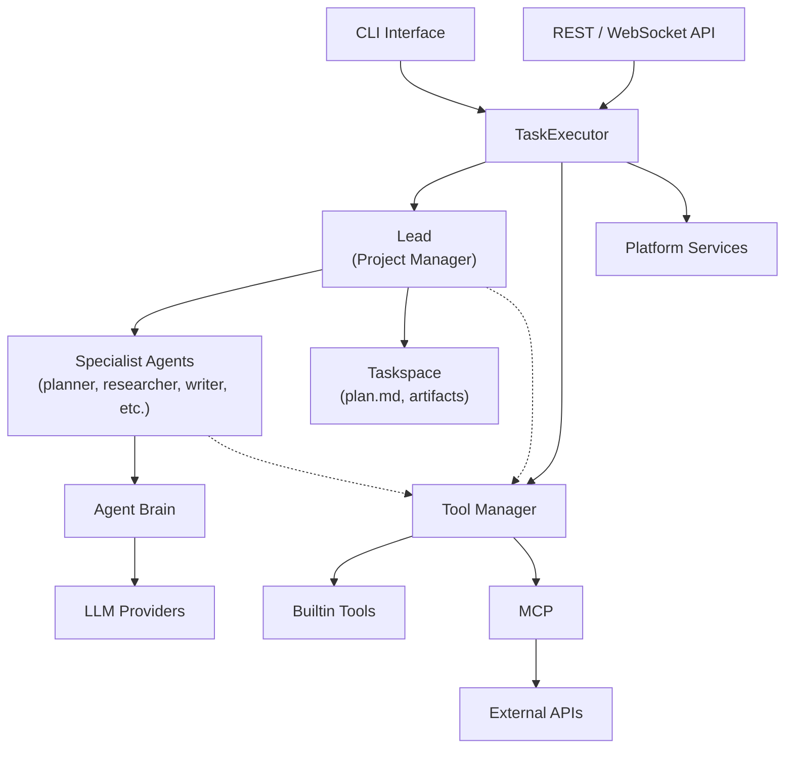
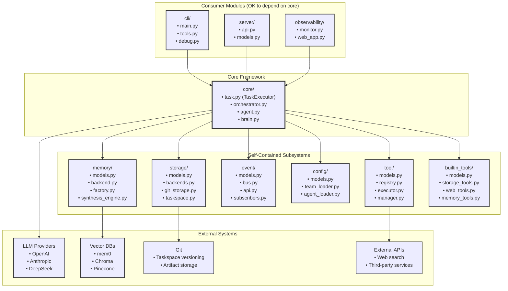
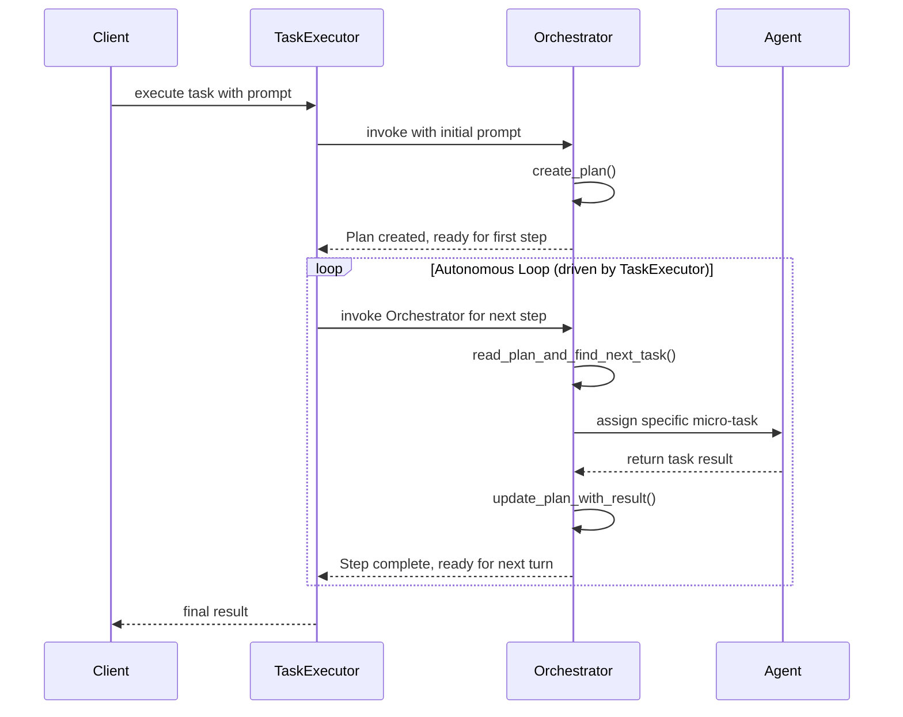
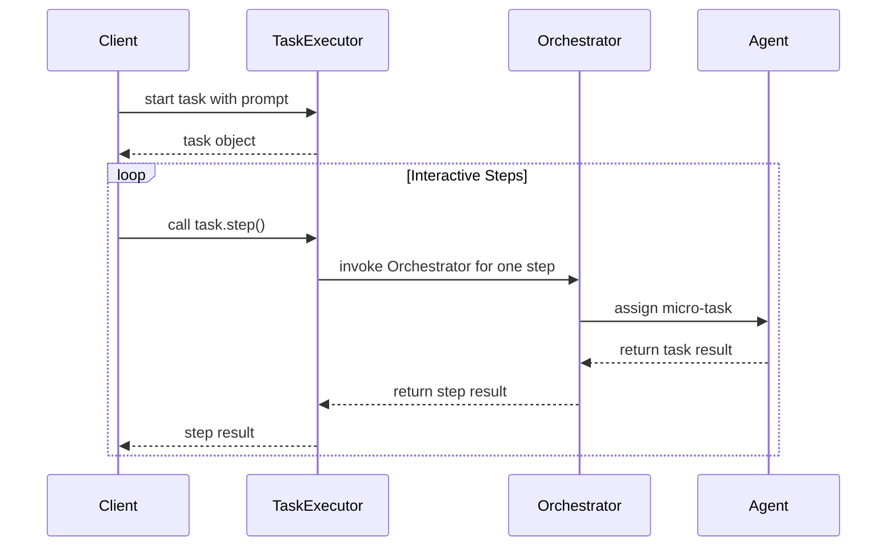
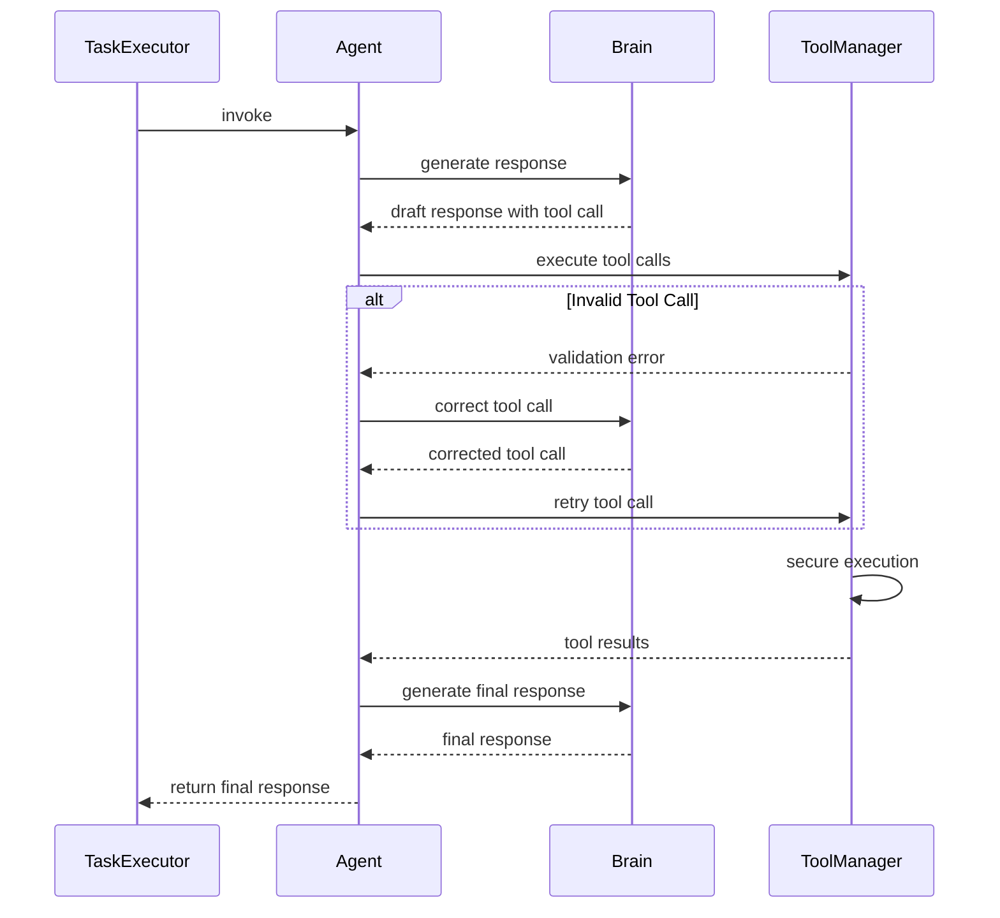

# VibeX System Architecture

## 1. Executive Summary

VibeX is an open-source backbone for building secure, observable, and fully autonomous multi-agent systems. A lightweight micro-kernel orchestrates specialised agents, turning a single user request into a coordinated workflow that spans tool execution, memory retrieval, and artifact management—all within isolated, version-controlled taskspaces. Every decision, message, and side effect is captured as a structured event, providing complete auditability and real-time insight into system behaviour.

## 2. Vision & Principles

### 2.1 Project Vision

VibeX enables organisations to decompose complex goals into collaborative **Teams** of agents, each focusing on a well-defined role. A stateful **Orchestrator** governs the workflow, assigns tasks to agents, and executes tools on the agents' behalf, while a **Task Executor** drives the lifecycle of the task itself. The result is a flexible framework that elevates individual agent capabilities into a cohesive, self-optimising system that can learn, adapt, and scale with minimal human intervention.

### 2.2 Architectural Principles

The architecture rests on the following foundational principles:

- **Separation of Concerns**: Each subsystem has a single, well-defined responsibility, which reduces coupling and simplifies maintenance.
- **Orchestrator-Driven Orchestration**: A stateful Orchestrator governs coordination, planning, and task assignment.
- **Agent Autonomy**: Agents manage their own reasoning loops and private Brains, delegating only cross-cutting concerns upward.
- **Event-Driven Coordination**: Asynchronous, structured events enable scalable, loosely-coupled communication among subsystems.
- **Configuration-Driven Behaviour**: Teams, agents, and workflows are defined declaratively, allowing rapid iteration without code changes.
- **Security by Design**: All external interactions pass through audited, policy-enforced channels; least-privilege boundaries are maintained throughout.
- **Taskspace Isolation**: Every task executes in its own version-controlled taskspace, ensuring reproducibility and clean separation of artifacts.

## 3. System Architecture Overview



The VibeX architecture follows a **clean dependency inversion principle** with four distinct layers:

- **Consumer Modules**: User-facing interfaces that depend on core in a single direction. Includes CLI tools, REST/WebSocket APIs, and observability dashboards. These modules can freely import from core without creating circular dependencies.

- **Core Framework**: The central layer containing `TaskExecutor`, `Orchestrator`, `Agent`, and `Brain` components. Core imports FROM subsystems rather than the other way around, implementing true dependency inversion.

- **Self-Contained Subsystems**: Independent modules that never import from core, each with their own `models.py` for data types. Includes `tool/`, `memory/`, `event/`, `config/`, `storage/`, and `builtin_tools/`. This design eliminates circular imports and enables independent development and testing.

- **External Systems**: All external dependencies such as LLM providers, vector databases, Git repositories, and third-party APIs.

### 3.1 Architectural Benefits

This clean separation provides several key advantages:

- **No Circular Dependencies**: Subsystems are self-contained and never import from core, eliminating import cycles and dependency hell.
- **Independent Development**: Teams can work on subsystems without needing deep core knowledge or causing integration conflicts.
- **Easier Testing**: Each subsystem can be tested in isolation with minimal mocking requirements.
- **Pluggable Architecture**: Subsystems can be swapped or extended without modifying core components.
- **Clear Boundaries**: The dependency flow is unidirectional and predictable, making the codebase easier to understand and maintain.

### 3.2 Implementation Dependency Structure

While the conceptual object model above shows how components relate functionally, the implementation follows a clean dependency architecture where subsystems are self-contained and core components import FROM subsystems (dependency inversion):



**Key Architectural Principles:**

- **Dependency Inversion**: Core framework imports FROM subsystems, not the other way around
- **Self-Contained Subsystems**: Each subsystem has its own models.py and doesn't import from core
- **Single Source of Truth**: Each data model has one canonical definition in its subsystem
- **Clean Boundaries**: Clear separation between framework core and implementation details

## 4. Collaboration Model

In VibeX, a **Team** of collaborating agents is the primary mechanism for executing complex tasks. The core runtime consists of three key components that work in concert to manage the task lifecycle.

### 4.1 Key Roles

**Orchestration Logic (Built into XAgent)**

- **Stateful:** Maintains task progress in `plan.json` and taskspace files
- **Intelligent Routing:** Decides which specialist agent handles each step
- **Persistent:** Survives across multiple turns and can resume interrupted tasks
- **LLM-Powered:** Uses Brain for intelligent decision making

**Specialist Agents (The Workers)**

- **Stateless:** No memory between invocations
- **Focused:** Each agent has one clear expertise (defined by prompt file)
- **Reusable:** Same agent can be used by different Orchestrators for different tasks
- **Standard Library:** Framework provides common agents (planner, researcher, writer, reviewer)

**XAgent (The Unified Interface)**

- **Conversational Interface:** Single point of contact for all user interactions
- **Lifecycle Manager:** Handles taskspace setup, tool management, streaming
- **Orchestration Logic:** Built-in intelligent routing and task coordination
- **Stateful:** Maintains conversation history and task state

### 4.2 Execution Modes

VibeX supports two primary modes of execution, offering a trade-off between autonomy and control.

**1. Autonomous Execution (`execute_task`)**

This "fire-and-forget" mode is ideal for production. A client submits a task and waits for a final result, while the `Task Executor` runs the entire multi-agent collaboration, driven by the `Orchestrator`.



**2. Interactive Execution (`start_task` & `step`)**

For debugging or human-in-the-loop workflows, a client can call `start_task` to get a `Task` object, then repeatedly call `step()` to advance the execution one turn at a time. This mode is more aligned with traditional agentic frameworks.



### 4.3 Orchestrator vs Specialist Agents: A Key Distinction

The VibeX architecture makes a crucial distinction between two types of intelligence:

**The Orchestrator (Project Manager)**

- A stateful Python class that owns the entire workflow
- Orchestrates the task from start to finish
- Creates plans by delegating to specialist agents
- Routes work to the best-suited specialist for each step
- Tracks progress and maintains state in `plan.md`

**Specialist Agents (Workers)**

- Stateless, single-purpose experts defined by prompt files
- Each has one clear responsibility (planning, research, writing, etc.)
- Invoked by the Orchestrator to perform specific micro-tasks
- Return results and forget - no state management

**Example Flow:**

1. Orchestrator receives: "Write a report on AI trends"
2. Orchestrator delegates to Planner Agent: "Create a step-by-step plan"
3. Planner creates `plan.md` with checklist
4. Orchestrator reads plan, assigns "Research AI trends" to Researcher Agent
5. Orchestrator assigns "Write introduction" to Writer Agent
6. Orchestrator continues until all steps complete

This separation ensures that complex orchestration logic lives in robust Python code, while domain expertise lives in easily-editable prompts.

## 5. Agent Internals

While the `Task Executor` manages the high-level conversation flow between agents, each `Agent` is responsible for its own internal reasoning process. This process involves hydrating a prompt template with runtime context, executing a "monologue" with its private Brain, and optionally streaming its response back to the client.

### 5.1 Prompt Templating

An agent's core behavior and persona are defined by its system prompt, which is typically loaded from a Jinja2 template file. Before the `Task Executor` invokes an agent, it injects dynamic context into this template. This ensures the agent is fully aware of the current state of the task. Common context variables include:

- The full conversation history.
- A list of available tools and their JSON schemas.
- The initial task objective and any user-provided parameters.
- Summaries or references to artifacts in the taskspace.

This just-in-time templating allows agents to be both powerful and reusable, adapting their behavior to the specific needs of each task.

### 5.2 Internal Monologue and Tool-Calling Loop

When an agent is invoked by the `Task Executor`, it enters a sophisticated internal loop to produce the most informed output possible. This loop includes a crucial self-correction mechanism for tool usage.

1.  **Initial Reasoning**: The `Agent` passes the prompt to its `Brain` (LLM), which generates an initial response that may include one or more desired tool calls.
2.  **Direct Tool Execution**: The `Agent` executes tool calls directly through the `ToolManager` provided by the Task Executor. This eliminates the need for inter-component communication and provides faster, more secure tool execution.
3.  **Validation and Self-Correction**: The `ToolManager` validates the calls against the registered tool schemas and security policies.
    - If a call is invalid, the `ToolManager` immediately returns a structured validation error. The `Agent` then passes this error back to the `Brain`, which attempts to generate a corrected tool call. This loop continues until the call is valid.
4.  **Secure Execution**: Once a tool call is valid, the `ToolManager` executes it securely through its integrated `ToolExecutor`, which runs tools in a secure sandbox when necessary.
5.  **Result Integration**: The results are returned directly to the `Agent`, which gives them to the `Brain`. The `Brain` uses this new information to generate its final, grounded response for the turn.
6.  **Final Response**: The `Agent` returns its final response to the `Task Executor`, completing its turn.

This streamlined process ensures that agents can autonomously use tools with minimal overhead, correct their own mistakes, and ground their reasoning in real-world information before finalizing their output.



### 5.3 End-to-End Streaming

To provide maximum transparency and a highly responsive user experience, VibeX is designed for **end-to-end streaming**. This is more than just streaming the final answer; it means that every significant piece of text generated during the task lifecycle is yielded back to the client in real-time.

This is achieved by making streaming the default behavior at every layer of the stack:

- **Brain**: The `Brain` streams token-by-token output directly from the underlying LLM provider.
- **Agent**: The `Agent` streams its internal monologue, including its reasoning process and its decision to call tools.
- **Task Executor**: The `Task Executor` orchestrates these streams, interleaving agent monologues with tool execution status messages and final outputs.

This architecture allows a developer or user to watch the entire multi-agent collaboration unfold in real-time, offering unparalleled insight for debugging, monitoring, and human-in-the-loop interaction. It transforms the "black box" of agent reasoning into a transparent, observable process.

## 6. State and Context Management

VibeX is designed around the core principle that agents should operate on a rich, durable, and easily accessible context. This is achieved through two tightly integrated components: the **Taskspace** and the **Memory System**.

### 6.1 Taskspace: A Durable Foundation

The **Taskspace** is the stateful heart of every task. It is a version-controlled directory that provides the foundation for iterative development, task resumption, and human-in-the-loop collaboration. By persisting every message, artifact, and state change to the taskspace, VibeX guarantees full auditability and allows tasks to be paused, inspected, modified, and resumed at any point.

**Multi-Tenant Architecture**: All taskspaces are user-scoped with the structure `taskspace/{user_id}/{task_id}/` to provide organizational separation between users. See the [Multi-Tenant Architecture](/design/multi-tenant-security) documentation for details on user isolation patterns and required authentication for secure deployments.

Every taskspace contains:

- A complete, append-only log of the conversation history (`history.jsonl`).
- A version-controlled `artifacts` directory where all agent outputs (code, documents, data) are stored.
- A `state.json` file capturing the latest state of the Task Executor and all agents.

This robust state management is what enables developers to treat tasks not as ephemeral processes, but as durable, long-running workflows that can be debugged, refined, and improved over time.

### 6.2 Memory: Intelligent Context Retrieval

The **Memory** acts as the intelligent, unified gateway for retrieving contextual data from the Taskspace. It is more than a simple wrapper around a vector database; it is the sole entry point for agents to perform intelligent data fetching, ensuring they have the most relevant information without exceeding token limits.

**User Isolation**: Memory storage is scoped to prevent cross-user access, ensuring that agents can only retrieve contextual information from their own user's taskspaces and memory stores.

Its responsibilities are twofold:

1.  **Context Ingestion**: It automatically captures and indexes conversational history, agent-generated artifacts, and other designated data sources from the Taskspace into a long-term, searchable store.
2.  **Intelligent Retrieval**: It provides a simple query interface for agents to retrieve contextually relevant information. The system handles the complexity of searching across different data types and uses semantic ranking to return only the most salient facts.

By abstracting away the complexities of data storage and retrieval, the Memory System allows agents to remain focused on reasoning, while ensuring their prompts are always grounded with high-quality, relevant context from the Taskspace.

### 6.3 Example Scenario: Context-Aware Writing

To illustrate how these components work together, consider a `Writer` agent tasked with drafting a report. A `Researcher` agent has already run, populating the `Taskspace` with dozens of source documents.

1.  **Initial State**: The `Taskspace` contains all source documents as artifacts (e.g., `source_01.txt`, `source_02.txt`, etc.). The `Memory System` has indexed the content of each of these sources. The main report is still empty.
2.  **Writing the First Section**: The `Writer` is tasked with "Write the introduction." It queries the `Memory System`: _"Find sources relevant to the overall topic."_ The `Memory System` returns the most relevant source documents. The `Writer` uses them to draft the introduction, which is then saved back to the `Taskspace` as `report_v1.md`.
3.  **Preventing Redundancy**: When the `Writer` is next tasked with "Write the 'History of AI' section," it performs a more sophisticated query: _"Find sources related to 'the history of AI' that are not already referenced in `report_v1.md`."_
4.  **Intelligent Retrieval**: The `Memory System` understands this query. It performs a semantic search for "history of AI" across all source documents, but it also performs a negative semantic search, filtering out any sources whose content closely matches what is already in `report_v1.md`.
5.  **Grounded Response**: The `Memory System` returns a fresh, relevant, and unused set of sources. The `Writer` can now draft the new section with confidence, knowing it is not repeating information.

This scenario demonstrates how the combination of a durable `Taskspace` and an intelligent `Memory System` enables agents to perform complex, stateful tasks that would be impossible with a simple conversational context window.

### 6.3 Standard Agents Library

VibeX ships with a curated library of specialist agents in `src/vibex/agents/`:

**Core Workflow Agents:**

- `planner.md` - Creates step-by-step plans as markdown checklists
- `researcher.md` - Conducts web research and synthesizes findings
- `writer.md` - Transforms research into well-structured documents
- `reviewer.md` - Reviews documents and provides constructive feedback

**Using Standard Agents:**

```yaml
# In your team.yaml
agents:
  - "planner"
  - "researcher"
  - "writer"
  - "reviewer"

lead: default # Uses the built-in Orchestrator class
```

**The Default Orchestrator Workflow:**

1. Delegates planning to the `planner` agent
2. Uses LLM-based routing to assign each step to the best specialist
3. Coordinates handoffs between research → writing → review phases
4. Maintains progress in `plan.md` for full transparency

This gives you a powerful multi-agent system with zero custom code.

## 7. Platform Services

Platform Services provide common capabilities that sit outside the tight execution loop yet remain essential to every task. They are deployed as shared, multi-tenant components and accessed via well-defined APIs, allowing the core runtime to stay lightweight while still benefiting from robust storage, configuration, and monitoring facilities.

### 7.1 Configuration System

The Configuration System is the single source of truth for teams, agents, tools, and runtime policies. It loads declarative YAML files, validates them against versioned schemas, and exposes the resulting objects to the Task Executor at startup.

### 7.2 Event Bus

All significant actions in the framework emit structured events that flow through the Event Bus. This design decouples producers from consumers, enabling real-time monitoring, auditing, and external integrations without burdening the hot code-path.

### 7.3 Memory System Infrastructure

While Section 6 described the Memory System from a business logic perspective, this section focuses on its infrastructure implementation. The Memory System uses a pluggable backend architecture that abstracts away the complexities of different memory storage implementations.

**Implementation Architecture**:

- **Memory Backend Interface**: A standardized interface that allows different memory providers (mem0, vector databases, etc.) to be plugged in seamlessly
- **mem0 Integration**: The default backend leverages mem0 for intelligent memory management, providing automatic memory extraction, storage, and retrieval
- **Vector Database Support**: Direct integration with vector databases for semantic search capabilities
- **Memory Factory Pattern**: A factory that instantiates the appropriate memory backend based on configuration

**Key Infrastructure Features**:

- **Automatic Indexing**: Background processes that continuously index new content from taskspaces
- **Scalable Storage**: Support for both local and distributed memory storage backends
- **Memory Lifecycle Management**: Automatic cleanup, archival, and optimization of stored memories
- **Provider Abstraction**: Clean separation between the memory interface and underlying storage technology

This infrastructure design ensures that the Memory System can scale from development environments using local storage to production deployments using enterprise-grade vector databases, all without changing the business logic layer.

### 7.4 Observability

The Observability service provides real-time insight into the inner workings of the VibeX framework. It subscribes to the `Event Bus` to receive a live stream of all system events—from task creation to agent handoffs to tool executions. This data is then exposed through a built-in web dashboard, allowing developers to:

- Visually trace the entire lifecycle of a task.
- Inspect the contents of any agent's taskspace, including conversation history and artifacts.
- Debug complex multi-agent interactions in real-time.

By making the system transparent by default, the Observability service dramatically reduces the time required to build, test, and refine sophisticated agent-based workflows.

## 8. Tool Management Architecture

The VibeX framework uses a unified **ToolManager** architecture that provides task-level tool isolation and streamlined execution. Each Task Executor creates its own ToolManager instance, ensuring that tool registrations and executions are isolated between different tasks.

### 8.1 ToolManager Components

The ToolManager combines three key components:

- **ToolRegistry**: Manages tool definitions, schemas, and discovery. Handles tool registration and provides JSON schemas for LLM consumption.
- **ToolExecutor**: Handles secure tool execution with validation, security policies, performance monitoring, and sandbox isolation.
- **Task Isolation**: Each task gets its own ToolManager instance, preventing tool conflicts and enabling task-specific tool configurations.

### 8.2 Benefits of the New Architecture

- **Simplified Agent Interface**: Agents execute tools directly via the Task Executor's ToolManager, reducing complexity and improving performance.
- **Enhanced Security**: Tool execution happens within the Task Executor's controlled environment with comprehensive security policies and validation.
- **Better Performance**: Direct tool execution eliminates inter-component communication overhead.
- **Task Isolation**: Each task maintains its own tool registry, enabling custom tool configurations per task.

## 9. Builtin Tools

Builtin Tools extend VibeX with first-class capabilities without requiring users to write custom plugins. They are registered automatically at startup and are available to any agent subject to security policy. These tools are designed to be general-purpose and cover the most common needs of autonomous agents.

Key builtin tools include:

- **Storage Tools**: Clean file operations that use the storage layer, providing secure taskspace-scoped file management with proper isolation and version control. Includes `read_file`, `write_file`, `list_directory`, `delete_file`, and other essential file operations.
- **Web Tools**: Advanced web capabilities including `web_search`, `extract_content` for web scraping, and `automate_browser` for AI-driven browser automation using natural language instructions.
- **Memory Tools**: Direct interface to the Memory system for storing and retrieving contextual information across task sessions.
- **Context Tools**: Tools for managing and updating task context variables, allowing agents to maintain and share state information.
- **Planning Tools**: Sophisticated task planning and execution tracking tools that help agents break down complex tasks into manageable phases.
- **Search Tools**: Web search capabilities using multiple search engines (Google, Bing, DuckDuckGo) with configurable parameters.

By providing these foundational capabilities, VibeX ensures that developers can build powerful and effective agent teams from day one.

## 10. Extensibility

VibeX is designed as a production-ready backbone, which means it must be extensible at every layer.

- **Adding LLM Providers**: The `Brain` component uses a provider model that allows new LLMs to be integrated by implementing a simple, common interface.
- **Custom Tools**: Developers can add their own tools by decorating Python functions. These are registered with the task's ToolManager and exposed to agents in the same way as standard tools.
- **MCP Tools & API Integration**: For complex integrations, the framework supports Multi-Container Platform (MCP) tools, which run in secure sandboxes, allowing safe interaction with enterprise APIs and SaaS platforms.

## 11. The Future of VibeX

VibeX will continue to evolve along three pillars: performance, interoperability, and safety. Upcoming priorities include native support for streaming multimodal models, tighter integration with external knowledge graphs to improve grounding, and progressive guardrail policies that adapt to organisational compliance requirements. We also plan to continue enhancing the default **Orchestrator** and **Standard Agent** library to make the framework even more powerful out of the box.
