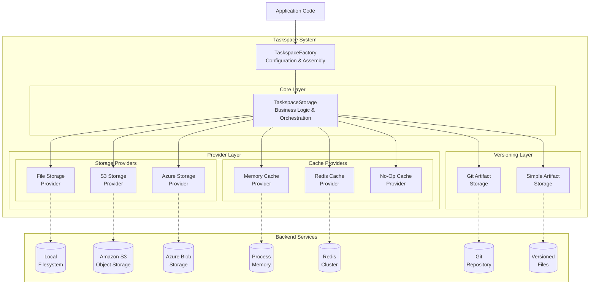

# Taskspace System Design

## Overview

The Taskspace System manages all persistent data and state throughout the lifecycle of agent tasks. It handles execution plans, artifacts, messages, and memory with support for versioning, caching, and multiple storage backends.

## Problem Statement

Agent tasks present unique data challenges: long-running execution, concurrent access, versioned outputs, and interruption recovery. The system must scale from local development to distributed cloud deployments without code changes.

### Core Data Types

**Task Execution State** - The execution plan and progress tracking. Frequently read and updated by the orchestrator.

**Versioned Artifacts** - Generated code, reports, and data files with full version history for rollback and reproducibility.

**Communication History** - Append-only log of agent messages, user interactions, and system events.

**Task Metadata** - Configuration, statistics, and summary information for monitoring and debugging.

**Agent Memory** - Key-value store for short-term working memory and long-term knowledge.

## Key Design Decisions

**Environmental Adaptability** - Zero dependencies for local development, pluggable providers for production. Storage and cache implementations can be swapped without changing core logic.

**Interruption Resilience** - Atomic operations, frequent state persistence, and clear recovery points enable tasks to resume after crashes or interruptions.

**Performance at Scale** - Two-tier architecture separates storage (where data lives) from caching (access speed), allowing independent optimization.

**Version Control** - Git-first for artifacts when available, with automatic fallback to simple file-based versioning.

## Architecture



The architecture implements these key principles:

- **Provider Pattern** - Storage providers (file, S3, Azure) and cache providers (memory, Redis) can be mixed and matched
- **Integrated Caching** - Built into TaskspaceStorage with write-through pattern for consistency
- **Factory Configuration** - Register providers at startup, create taskspaces as needed

## Implementation Strategy

### Storage Provider Interface
```python
class StorageProvider(ABC):
    async def read(self, path: str) -> bytes
    async def write(self, path: str, data: bytes) -> None
    async def exists(self, path: str) -> bool
    async def delete(self, path: str) -> None
    async def list(self, prefix: str) -> List[str]
```

### Cache Strategy

The system uses **write-through caching** - all writes go to both storage and cache, ensuring the cache never becomes stale. This eliminates the need for TTLs or expiration logic. Cache entries are only evicted when:
- Memory limits are reached (LRU eviction)
- Explicit invalidation on delete operations
- Cache service restart

### Performance Benchmarks

Comprehensive benchmarks on realistic workloads demonstrate significant performance improvements with caching enabled:

| Operation | No Cache | Memory Cache | Memory Speedup | Description |
|-----------|----------|--------------|----------------|-------------|
| Get Plan | 0.34ms | 0.00ms | **317.3x** | Retrieve task execution plan |
| List Artifacts | 0.42ms | 0.00ms | **404.9x** | List all stored artifacts |
| Get Artifact | 0.77ms | 0.00ms | **574.5x** | Retrieve specific artifact content |
| Get Conversation | 11.14ms | 0.00ms | **8,898.7x** | Retrieve message history |
| Get Summary | 0.69ms | 0.00ms | **653.9x** | Generate taskspace summary |

**Summary Statistics:**
- Average speedup: **1,550.2x**
- Maximum speedup: **8,898.7x** (conversation history)
- Minimum speedup: **1.0x** (write operations)

**Key Insights:**
- Read operations show dramatic speedups (300-8,000x)
- Write operations maintain consistent performance (no degradation)
- Conversation history benefits most from caching due to message aggregation
- Memory cache provides sub-millisecond response times for cached data

*Benchmark methodology: 100 iterations per operation on realistic data (50-task plans, 5 artifacts with substantial content, 40 conversation messages). Results measured on macOS with local filesystem.*

### Concurrency Handling

- **Atomic writes** - Temp file + rename for consistency
- **Append-only logs** - No conflicts for messages
- **Git merging** - Built-in conflict resolution
- **Cache invalidation** - Write-through pattern

## Usage Examples

### Local Development
```python
taskspace = TaskspaceFactory.create_taskspace(
    base_path="./taskspaces",
    task_id="dev-task-123"
)
```

### Production with Caching
```python
# Startup: register Redis
TaskspaceFactory.register_cache_provider("redis", redis_cache)

# Runtime: create with cache
taskspace = TaskspaceFactory.create_taskspace(
    base_path="./taskspaces",
    task_id=task_id,
    cache_provider="redis"
)
```

### Cloud Storage
```python
# Startup: register S3
TaskspaceFactory.register_storage_provider("s3", S3Provider)

# Runtime: S3 + Redis
taskspace = TaskspaceFactory.create_taskspace(
    base_path="s3://bucket",
    task_id=task_id,
    storage_provider="s3",
    cache_provider="redis"
)
```

## Trade-offs and Considerations

Every architectural decision involves trade-offs. We've consciously optimized for developer experience and operational flexibility over absolute performance or feature completeness.

**File-Based Default Storage** trades some performance for simplicity and debuggability. Developers can inspect task state with standard tools, grep through message logs, and understand system behavior without specialized knowledge.

**Optional Caching** adds complexity but provides crucial performance benefits at scale. The no-op cache option allows disabling caching entirely for debugging, while the cache-aside pattern ensures the storage layer remains the source of truth.

**Git Dependency** for versioning is optional but highly recommended. While the simple storage fallback provides basic functionality, Git's features like branching, tagging, and distributed operation significantly enhance the system's capabilities.

## Conclusion

The Taskspace System provides a robust foundation for AgentX's data management needs. By carefully analyzing usage patterns and designing targeted solutions for each data type, we've created a system that scales from laptop to cloud while maintaining simplicity where it matters most. The provider-based architecture ensures the system can evolve with changing requirements, while the clean separation of concerns keeps the core logic understandable and maintainable.

The true test of this design is that developers shouldn't need to think about it during normal usage - it should just work, providing fast access to data when needed and reliable persistence throughout the task lifecycle. Only when scaling to production or debugging complex scenarios should the underlying sophistication become apparent, and even then, the layered architecture ensures each concern can be addressed independently.